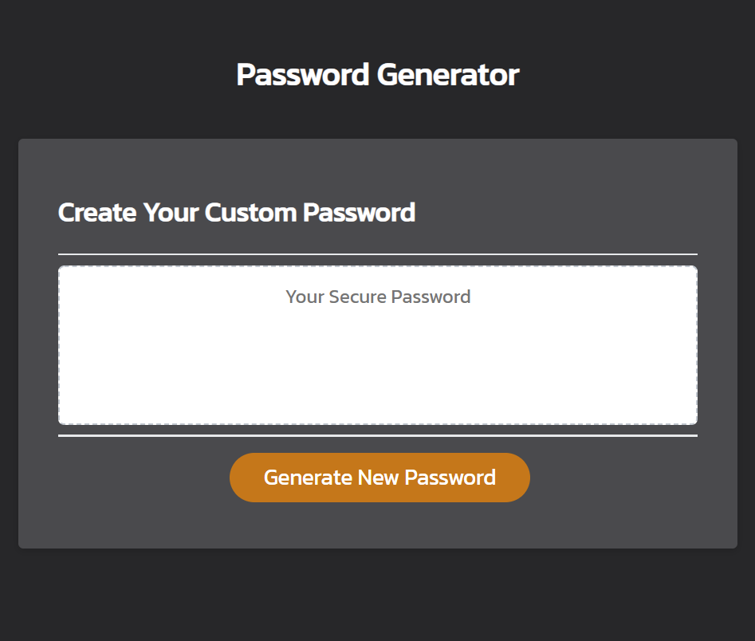

# Random Password Generator

## Summary
A small frontend app that let's you generate a random password using alerts and prompts in the browser.

## Description
This is probably the billionth password generator ever created, but for me it was a great lesson in writing vanilla JavaScript and using JS Popup Boxes like "prompt", "alert" and "confirm" to gather data and send information to the client. Yes, there could be check boxes and input forms to take in user data, but I've never used popup boxes before so this was a great way to familiarize myself with this JavaScript feature.

In order to make the random password feature work, I decided to have four separate types of values that the user can include in the password: lower case letters, upper case letters, numbers, and symbols. There is an array containing each of the values in those categories and, depending on which ones the user chooses, random values will be pushed into a new password for them.

## Usage
This app is deployed with github pages.

**Instructions**:
1. Click this [github pages link](https://sherb93.github.io/Password-Generator/).
2. Click "Generate New Password"
3. Follow the prompts that appear at the top of the page.
4. Copy and paste your new password wherever you wish!
---

## ScreenShot:
